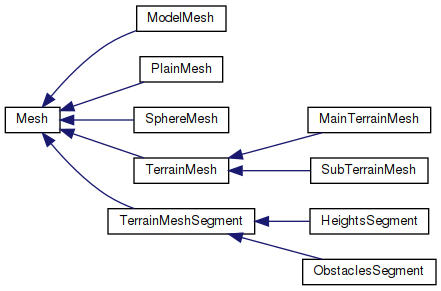
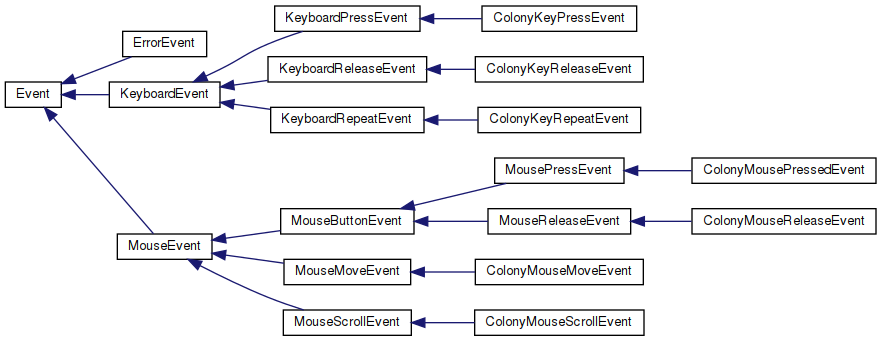

# Fig
Fig (or Ficus carica) is my attempt to explore game engine. It was initiated in https://github.com/ardazishvili/colony.git repository.

## Main class hierarchies
Updated list of diagrams generated by doxygen.
- Meshes<br/>
- Events<br/>

## Codestyle
Defined by .clangformat. Vim setted up to autoformat code on every 'write' through vim-clang-format plugin.

## Documentation
Classed have to be documented. Right now doxygen generates usefull class diagrams.

## Build
Cmake is used. 'compile_commands.json' is generated by adding '-DCMAKE_EXPORT_COMPILE_COMMANDS=ON' and used by youcompleteme vim plugin. Tested only in Linux(Ubuntu 18.04, 5.3.0-26-generic). gcc: 7.4.0. Dependencies: none.  Build type: static library.

Sample commands:

```sh
mkdir cbuild && cd cbuild
cmake -DCMAKE_BUILD_TYPE=Debug -DCMAKE_EXPORT_COMPILE_COMMANDS=ON ..
make
```

## TODO
1. Refactor:  logging, etc.
2. Introduce: layers
3. Encapsulate dependencies to make it possible to build on other platforms.
4. Encapsulate OpenGL: make it substitutable by other libs.
